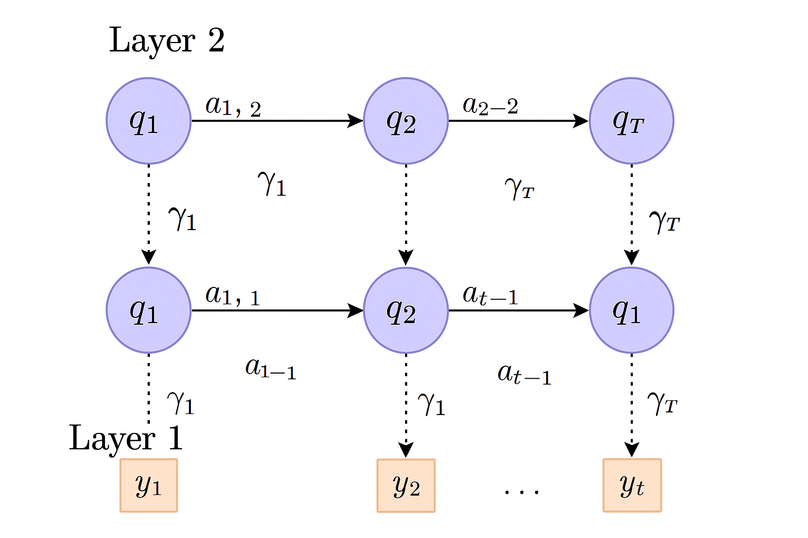
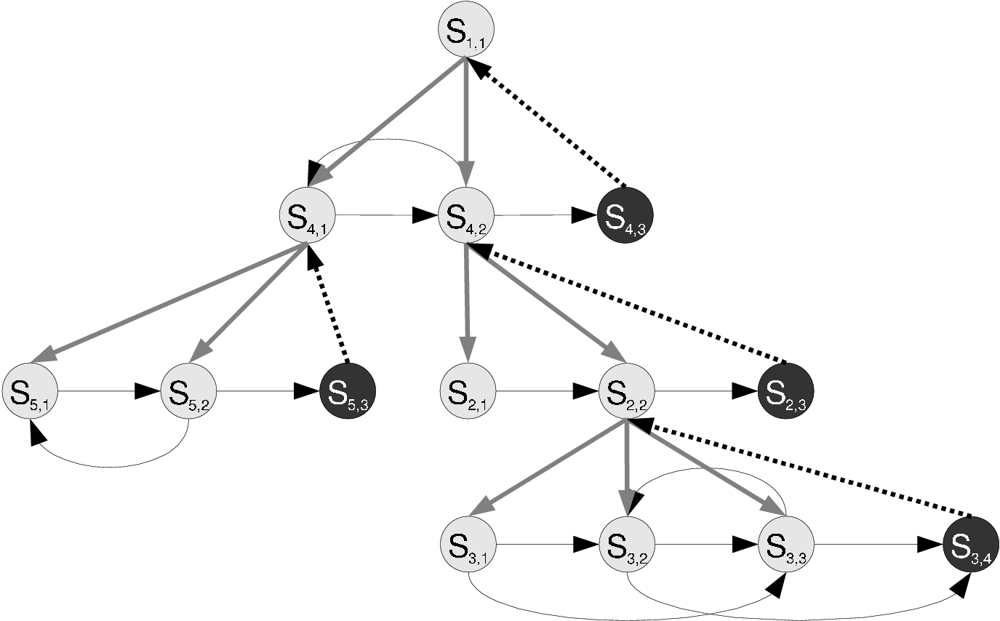

# Model 


- [Hidden Markov Model at a glance](#hidden-markov-model-at-a-glance)
- [Hidden Markov Model](#hidden-markov-model)
  - [Hyperparameters](#hyperparameters)
  - [Iterative Fitting](#iterative-fitting)
  - [Output](#output)
  - [Code](#code)
- [Layered Hidden Markov Model](#layered-hidden-markov-model)
  - [Overview](#overview)
  - [Use Cases](#use-cases)
  - [Hyperparameters](#hyperparameters-1)
  - [Limitations](#limitations)
  - [Output](#output-1)
- [Hierarchical Hidden Markov Model](#hierarchical-hidden-markov-model)
- [Evaluation Metric: Log-Likelihood with Entropy Regularization](#evaluation-metric-log-likelihood-with-entropy-regularization)
  - [Overview](#overview-2)
  - [Formula](#formula)
  - [Purpose](#purpose)
  - [Code](#code-2)
- [References](#references)

## Hidden Markov Model at a glance

A **Hidden Markov Model (HMM)** is a statistical model that assumes the system being modeled is a Markov process with unobserved (hidden) states. It is particularly well-suited for time-series data where the true state of the system is not directly observable but can be inferred through observed signals.

Key concepts:

- **States**: Hidden regimes that evolve over time according to a Markov process.

- **Observations**: The data we observe, which is probabilistically emitted from the hidden states.

- **Transition Probabilities**: The likelihood of moving from one state to another.

- **Emission Probabilities**: The likelihood of observing a given output from a particular state.

HMMs are commonly used in:

- Financial market regime detection

- Speech recognition

- Bioinformatics (e.g., gene prediction)

- Anomaly detection in time-series data

This implementation leverages the `hmmlearn` library to train a Gaussian HMM on financial volatility features. Layered variants extend the base HMM by stacking multiple models, where each layer learns patterns from the probabilistic output of the previous layer, enabling more expressive and hierarchical regime detection.


## Hidden Markov Model 

The `HMMModel` is a probabilistic time series model built using a **Gaussian Hidden Markov Model (HMM)**. It is suitable for modeling **regime-switching behavior**, such as different volatility regimes in financial markets. This implementation leverages the `hmmlearn` library and is designed for use on multivariate time series data.

A **Hidden Markov Model** consists of:

- **Hidden States**: Unobservable regimes (e.g., low, medium, high volatility).

- **Observations**: Observable data (e.g., volatility of returns and VIX as proxy).

- **Transition Probabilities**: Probabilities of switching between states.

- **Emission Probabilities**: Distributions (e.g., Gaussians) describing how observations are generated from hidden states.

```yaml
HMMModel:
  covariance_type: "full"
  random_seed: 13
  init_params: "stmc"
  n_fits: 100
  tol: 1e-4
  max_components: 2
```

### Hyperparameters

The model supports the following hyperparameters through the configuration object:

| Hyperparameter     | Type    | Description                                                                 |
|--------------------|---------|-----------------------------------------------------------------------------|
| `covariance_type`  | `str`   | Specifies the form of the covariance matrix.                                |
| `random_seed`      | `int`   | Seed for reproducibility. Ensures consistent random number generation.      |
| `init_params`      | `str`   | Specifies which model parameters to initialize:                             |
| `n_fits`           | `int`   | Number of training attempts per configuration. Used for robustness.         |
| `tol`              | `float` | Convergence threshold for log-likelihood change between iterations.         |
| `max_components`   | `int`   | Maximum number of hidden states (components) to try. Minimum is 2.          |


The full list of parameters can be found here [hmmlearn](https://hmmlearn.readthedocs.io/en/latest/api.html#hmmlearn.hmm.GaussianHMM). 

### Iterative Fitting

The model is trained using the Expectation-Maximization (EM) algorithm:

For each `n_components` in `[2, ..., max_components]`:

  - Train `n_fits` different models with different random seeds (this is done for a stability of a model, `n = 100` is computationallu heavier).

  - Fit using `GaussianHMM.fit(X_train)` from `hmmlearn`.

  - Evaluate each using the provided `evaluation_metric` to compare between different `random_states` and the number of components.

### Output

The model can output:
- **Trained HMM model object**
- **Predicted states** (relabeled by ascending volatility)
- **Log files** detailing errors, warnings, and training status

### Code

::: hmmstock.HMMModel

## Layered Hidden Markov Model 



### Overview

`LayeredHMMModel` is an extension of traditional Hidden Markov Models (HMMs) that allows for **layered (hierarchical) modeling of temporal regimes**. Each layer is trained sequentially:

- **Layer 1** is trained on raw input features.

- **Layer 2** is trained on raw input features and the **posterior probabilities** (state likelihoods) from Layer 1.

- ...

- **Layer N** is trained on outputs from Layer N-1.

This structure allows the model to capture higher-level and more abstract temporal dynamics over multiple layers.

### Use Cases

- Modeling complex temporal dependencies and latent dynamics

- We can hope to achieve the better separation of the regimes.

- We can abstract a more complex first layer


### Hyperparameters 

| Parameter        | Type     | Description                                                              |
|------------------|----------|--------------------------------------------------------------------------|
| `min_components` | `int`    | Minimum number of hidden states to try                                   |
| `max_components` | `int`    | Maximum number of hidden states to try                                   |
| `covariance_type`| `str`    | Form of covariance matrix (`'full'`, `'diag'`, etc.)                     |
| `init_params`    | `str`    | Parameters to initialize during training (`'stmc'`)                      |

```yaml
LayeredHMMModel:
  num_layers: 2
  n_fits: 100
  random_seed: 13
  tol: 1e-4
  layers:
    - min_components: 2
      max_components: 4
      covariance_type: "full"
      init_params: "stmc"
    - min_components: 2
      max_components: 2
      covariance_type: "full"
      init_params: "stmc"
```

General parameters inherited from the global config:

| Parameter     | Description                                           |
|---------------|-------------------------------------------------------|
| `num_layers`  | Number of HMM layers to stack                         |
| `n_fits`      | Number of random initializations per configuration    |
| `tol`         | Convergence threshold for EM algorithm                |
| `random_seed` | Ensures reproducibility                               |


### Limitations

- **Computational cost**: Training multiple HMMs in sequence is resource-intensive
- **Overfitting risk**: Especially with many layers or high `max_components`
- **Data requirement**: Each layer needs sufficient data to train reliably


### Output

- A list of trained HMM models, one per layer
- Layered regime predictions (`predict_states`)
- Log messages to track training process, warnings, and failures


::: hmmstock.LayeredHMMModel

## Hierarchical Hidden Markov Model




Maybe will be added later.

<!-- 
### Overview 


The **Hierarchical HMM (H-HMM)** incorporates a two-level generative process:

- A **top-level HMM** governs transitions between high-level regimes (e.g., market regimes, phonemes).
- For each top-level state, a distinct **sub-HMM** is responsible for modeling the local dynamics of the observations within that regime.

1. At time \( t \), a regime \( Z_t \in \{1, \ldots, K\} \) is selected from the top-level HMM.
2. Given \( Z_t = k \), a sub-HMM \( HMM_k \) is used to emit \( X_t \) via its own internal hidden states.

This leads to a nested generative structure:
$$
P(X_{1:T}, Z_{1:T}, S_{1:T}) = \prod_{t=1}^T P(Z_t | Z_{t-1}) P(S_t^Z | S_{t-1}^Z) P(X_t | S_t^Z)
$$

Where:
- \( Z_t \): top-level regime
- \( S_t^Z \): sub-HMM hidden state at time \( t \) given \( Z_t \)


### Advantages

- Models regime-specific dynamics.
- Enables contextual transitions and multi-modal observation modeling.
- Especially useful when different segments of the data exhibit qualitatively different behaviors.


### Code

::: hmmstock.LayeredHMMModel -->

# Metric

##  Evaluation Metric: Log-Likelihood with Entropy Regularization

### Overview

The `LogLikelihoodWithEntropy` metric extends the standard log-likelihood scoring of HMMs by incorporating a regularization term based on the **entropy** of the hidden state distribution. This encourages the model to make use of all available states more evenly, thus avoiding degenerate solutions where only a few states dominate.

### 10 Formula


- \( \mathcal{L} = \log P(X \mid \theta) \): the log-likelihood of the validation data \( X \) under model parameters \( \theta \). This is additioanly scaled and then normalized by the length of sequences. The scaling is done in the `hmmlearn` package.
- \( \mathbf{p} = [p_1, p_2, \ldots, p_K] \): the empirical distribution of predicted states
- \( H(\mathbf{p}) = -\sum_{k=1}^K p_k \log(p_k + \epsilon) \): the entropy of the state distribution (with a small constant \( \epsilon \) to avoid log(0))
- \( \lambda \): the entropy regularization weight (configurable, default is 3)

The total evaluation score is:

$$
\text{Score} = \mathcal{L}  + \lambda \cdot H(\mathbf{p})
$$

Note: Although the metric doesn't depend on feature count directly, models trained on different feature sets will produce differently scaled log-likelihood values.


### Purpose

- **Encourages State Usage**: Models that evenly distribute probability mass across states receive higher entropy, and thus higher total score.
- **Combats Overfitting**: Prevents models from collapsing into trivial solutions with few active states.
- **Tunable Regularization**: The impact of entropy is controlled via the `entropy_weight` hyperparameter in the configuration file.


### Code

::: hmmstock.LogLikelihoodWithEntropy

# References

- Rabiner, L. R. (1989). *A Tutorial on Hidden Markov Models and Selected Applications in Speech Recognition*. *Proceedings of the IEEE*, 77(2), 257–286.

- `hmmlearn` Documentation. Available at: [https://hmmlearn.readthedocs.io/](https://hmmlearn.readthedocs.io/)

- Hong, C. Y., & Pitcan, Y. *An Introduction to the Use of Hidden Markov Models for Stock Return Analysis*. (Unpublished manuscript).

- Ramage, D. (2007). *Hidden Markov Models Fundamentals*. *CS229 Section Notes*, Stanford University, December 1, 2007.
